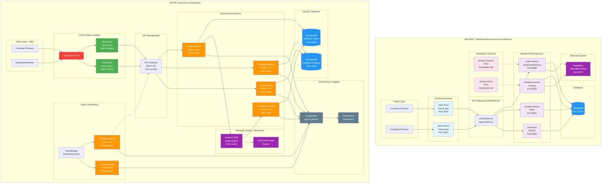

```mermaid
graph TB
    subgraph "BEFORE: Traditional Microservices Architecture"
        subgraph "Client Layer"
            C1[Customer Browser]
            C2[Employee Browser]
        end
        
        subgraph "Frontend Services"
            SF[store-front<br/>Vue.js App<br/>Port 3000]
            SA[store-admin<br/>Vue.js App<br/>Port 3001]
        end
        
        subgraph "API Gateway/Load Balancer"
            LB[Load Balancer<br/>nginx/HAProxy]
        end
        
        subgraph "Backend Microservices"
            OS[order-service<br/>JavaScript/Node.js<br/>Port 8080]
            PS[product-service<br/>Rust<br/>Port 8081]
            MS[makeline-service<br/>Golang<br/>Port 8082]
            AI[ai-service<br/>Python<br/>Port 8083]
        end
        
        subgraph "Message Queue"
            RMQ[RabbitMQ<br/>Message Broker<br/>Port 5672]
        end
        
        subgraph "Database"
            DB[(MongoDB<br/>Port 27017)]
        end
        
        subgraph "Simulation Services"
            VC[virtual-customer<br/>Rust<br/>Scheduled Job]
            VW[virtual-worker<br/>Rust<br/>Scheduled Job]
        end
        
        %% Connections
        C1 --> SF
        C2 --> SA
        SF --> LB
        SA --> LB
        LB --> OS
        LB --> PS
        LB --> AI
        
        OS --> DB
        PS --> DB
        MS --> DB
        AI --> DB
        
        OS --> RMQ
        MS --> RMQ
        
        VC -.-> OS
        VW -.-> MS
        
        %% Styling
        classDef frontend fill:#e1f5fe
        classDef backend fill:#f3e5f5
        classDef database fill:#e8f5e8
        classDef message fill:#fff3e0
        classDef simulation fill:#fce4ec
        
        class SF,SA frontend
        class OS,PS,MS,AI backend
        class DB database
        class RMQ message
        class VC,VW simulation
    end

    subgraph "AFTER: Serverless Architecture"
        subgraph "Client Layer - After"
            C3[Customer Browser]
            C4[Employee Browser]
        end
        
        subgraph "CDN & Static Hosting"
            CF[CloudFront CDN]
            S3F[S3 Bucket<br/>store-front<br/>Static Hosting]
            S3A[S3 Bucket<br/>store-admin<br/>Static Hosting]
        end
        
        subgraph "API Management"
            APIGW[API Gateway<br/>REST API<br/>Auto-scaling]
        end
        
        subgraph "Serverless Functions"
            L1[λ order-service<br/>Node.js 18.x<br/>Auto-scale]
            L2[λ product-service<br/>Python 3.9<br/>Auto-scale]
            L3[λ makeline-service<br/>Python 3.9<br/>Auto-scale]
            L4[λ ai-service<br/>Python 3.9<br/>Auto-scale]
        end
        
        subgraph "Message Queue - Serverless"
            SQS[Amazon SQS<br/>Order Queue<br/>Auto-scale]
            DLQ[SQS Dead Letter<br/>Queue]
        end
        
        subgraph "NoSQL Database"
            DDB1[(DynamoDB<br/>PetStore-Products<br/>Auto-scale)]
            DDB2[(DynamoDB<br/>PetStore-Orders<br/>Auto-scale)]
        end
        
        subgraph "Event Scheduling"
            EB[EventBridge<br/>Scheduled Rules]
            L5[λ virtual-customer<br/>Python 3.9<br/>Event-driven]
            L6[λ virtual-worker<br/>Python 3.9<br/>Event-driven]
        end
        
        subgraph "Monitoring & Logging"
            CW[CloudWatch<br/>Logs & Metrics]
            CWD[CloudWatch<br/>Dashboard]
        end
        
        %% Connections - After
        C3 --> CF
        C4 --> CF
        CF --> S3F
        CF --> S3A
        
        S3F --> APIGW
        S3A --> APIGW
        
        APIGW --> L1
        APIGW --> L2
        APIGW --> L4
        
        L1 --> DDB2
        L2 --> DDB1
        L3 --> DDB2
        L4 --> DDB1
        
        L1 --> SQS
        SQS --> L3
        SQS --> DLQ
        
        EB --> L5
        EB --> L6
        L5 -.-> APIGW
        
        L1 --> CW
        L2 --> CW
        L3 --> CW
        L4 --> CW
        L5 --> CW
        L6 --> CW
        CW --> CWD
        
        %% Styling - After
        classDef serverless fill:#ff9800,color:#fff
        classDef storage fill:#4caf50,color:#fff
        classDef database fill:#2196f3,color:#fff
        classDef message fill:#9c27b0,color:#fff
        classDef monitoring fill:#607d8b,color:#fff
        classDef cdn fill:#f44336,color:#fff
        
        class L1,L2,L3,L4,L5,L6 serverless
        class S3F,S3A storage
        class DDB1,DDB2 database
        class SQS,DLQ message
        class CW,CWD monitoring
        class CF cdn
    end
```    

