# CST8917-Final-Oral-Exam-Overview
CST8917 Final Oral Exam Overview
# Architecture Transformation Comparison

```mermaid
graph TB
    subgraph "BEFORE: Traditional Microservices Architecture"
        subgraph "Client Layer"
            C1[Customer Browser]
            C2[Employee Browser]
        end
        
        subgraph "Frontend Services"
            SF[store-front<br/>Vue.js App<br/>Port 3000]
            SA[store-admin<br/>Vue.js App<br/>Port 3001]
        end
        
        subgraph "API Gateway/Load Balancer"
            LB[Load Balancer<br/>nginx/HAProxy]
        end
        
        subgraph "Backend Microservices"
            OS[order-service<br/>JavaScript/Node.js<br/>Port 8080]
            PS[product-service<br/>Rust<br/>Port 8081]
            MS[makeline-service<br/>Golang<br/>Port 8082]
            AI[ai-service<br/>Python<br/>Port 8083]
        end
        
        subgraph "Message Queue"
            RMQ[RabbitMQ<br/>Message Broker<br/>Port 5672]
        end
        
        subgraph "Database"
            DB[(MongoDB<br/>Port 27017)]
        end
        
        subgraph "Simulation Services"
            VC[virtual-customer<br/>Rust<br/>Scheduled Job]
            VW[virtual-worker<br/>Rust<br/>Scheduled Job]
        end
        
        %% Connections
        C1 --> SF
        C2 --> SA
        SF --> LB
        SA --> LB
        LB --> OS
        LB --> PS
        LB --> AI
        
        OS --> DB
        PS --> DB
        MS --> DB
        AI --> DB
        
        OS --> RMQ
        MS --> RMQ
        
        VC -.-> OS
        VW -.-> MS
        
        %% Styling
        classDef frontend fill:#e1f5fe
        classDef backend fill:#f3e5f5
        classDef database fill:#e8f5e8
        classDef message fill:#fff3e0
        classDef simulation fill:#fce4ec
        
        class SF,SA frontend
        class OS,PS,MS,AI backend
        class DB database
        class RMQ message
        class VC,VW simulation
    end

    subgraph "AFTER: Serverless Architecture"
        subgraph "Client Layer - After"
            C3[Customer Browser]
            C4[Employee Browser]
        end
        
        subgraph "CDN & Static Hosting"
            CF[CloudFront CDN]
            S3F[S3 Bucket<br/>store-front<br/>Static Hosting]
            S3A[S3 Bucket<br/>store-admin<br/>Static Hosting]
        end
        
        subgraph "API Management"
            APIGW[API Gateway<br/>REST API<br/>Auto-scaling]
        end
        
        subgraph "Serverless Functions"
            L1[λ order-service<br/>Node.js 18.x<br/>Auto-scale]
            L2[λ product-service<br/>Python 3.9<br/>Auto-scale]
            L3[λ makeline-service<br/>Python 3.9<br/>Auto-scale]
            L4[λ ai-service<br/>Python 3.9<br/>Auto-scale]
        end
        
        subgraph "Message Queue - Serverless"
            SQS[Amazon SQS<br/>Order Queue<br/>Auto-scale]
            DLQ[SQS Dead Letter<br/>Queue]
        end
        
        subgraph "NoSQL Database"
            DDB1[(DynamoDB<br/>PetStore-Products<br/>Auto-scale)]
            DDB2[(DynamoDB<br/>PetStore-Orders<br/>Auto-scale)]
        end
        
        subgraph "Event Scheduling"
            EB[EventBridge<br/>Scheduled Rules]
            L5[λ virtual-customer<br/>Python 3.9<br/>Event-driven]
            L6[λ virtual-worker<br/>Python 3.9<br/>Event-driven]
        end
        
        subgraph "Monitoring & Logging"
            CW[CloudWatch<br/>Logs & Metrics]
            CWD[CloudWatch<br/>Dashboard]
        end
        
        %% Connections - After
        C3 --> CF
        C4 --> CF
        CF --> S3F
        CF --> S3A
        
        S3F --> APIGW
        S3A --> APIGW
        
        APIGW --> L1
        APIGW --> L2
        APIGW --> L4
        
        L1 --> DDB2
        L2 --> DDB1
        L3 --> DDB2
        L4 --> DDB1
        
        L1 --> SQS
        SQS --> L3
        SQS --> DLQ
        
        EB --> L5
        EB --> L6
        L5 -.-> APIGW
        
        L1 --> CW
        L2 --> CW
        L3 --> CW
        L4 --> CW
        L5 --> CW
        L6 --> CW
        CW --> CWD
        
        %% Styling - After
        classDef serverless fill:#ff9800,color:#fff
        classDef storage fill:#4caf50,color:#fff
        classDef database fill:#2196f3,color:#fff
        classDef message fill:#9c27b0,color:#fff
        classDef monitoring fill:#607d8b,color:#fff
        classDef cdn fill:#f44336,color:#fff
        
        class L1,L2,L3,L4,L5,L6 serverless
        class S3F,S3A storage
        class DDB1,DDB2 database
        class SQS,DLQ message
        class CW,CWD monitoring
        class CF cdn
    end
```    

## Component-by-Component Analysis

| Component | **BEFORE (Traditional)** | **AFTER (Serverless)** | **Benefits of Change** |
|-----------|--------------------------|------------------------|------------------------|
| **Frontend Hosting** | Vue.js apps on dedicated servers<br/>• store-front (Port 3000)<br/>• store-admin (Port 3001)<br/>• Requires server maintenance | S3 + CloudFront<br/>• Static hosting in S3 buckets<br/>• Global CDN distribution<br/>• Automatic SSL/TLS | • 99.99% availability<br/>• Global edge caching<br/>• No server management<br/>• Cost reduction ~70% |
| **Load Balancing** | nginx/HAProxy<br/>• Manual configuration<br/>• Single point of failure<br/>• Fixed capacity | API Gateway<br/>• Managed service<br/>• Auto-scaling<br/>• Built-in throttling | • Automatic scaling<br/>• Built-in DDoS protection<br/>• Request/response transformation<br/>• API versioning |
| **Backend Services** | Container-based microservices<br/>• order-service (Node.js)<br/>• product-service (Rust)<br/>• makeline-service (Golang)<br/>• ai-service (Python)<br/>• Always running (idle costs) | AWS Lambda Functions<br/>• λ order-service (Node.js 18.x)<br/>• λ product-service (Python 3.9)<br/>• λ makeline-service (Python 3.9)<br/>• λ ai-service (Python 3.9)<br/>• Pay-per-execution | • Zero idle costs<br/>• Automatic scaling (0-15,000)<br/>• Built-in fault tolerance<br/>• Millisecond billing<br/>• No server management |
| **Message Queue** | RabbitMQ<br/>• Self-managed<br/>• Single instance<br/>• Manual scaling<br/>• Requires monitoring | Amazon SQS + DLQ<br/>• Fully managed<br/>• Infinite scaling<br/>• Built-in dead letter queue<br/>• Automatic retry logic | • 99.9% availability SLA<br/>• No management overhead<br/>• Built-in monitoring<br/>• Encryption at rest/transit |
| **Database** | MongoDB<br/>• Self-hosted<br/>• Manual backups<br/>• Fixed provisioning<br/>• Schema management | DynamoDB<br/>• Fully managed NoSQL<br/>• Automatic backups<br/>• On-demand scaling<br/>• Multi-region replication | • Single-digit millisecond latency<br/>• 99.999% availability<br/>• Automatic scaling<br/>• Point-in-time recovery |
| **Scheduled Jobs** | Cron jobs on servers<br/>• virtual-customer (Rust)<br/>• virtual-worker (Rust)<br/>• Resource intensive | EventBridge + Lambda<br/>• λ virtual-customer<br/>• λ virtual-worker<br/>• Event-driven execution | • Pay only when running<br/>• Reliable scheduling<br/>• Built-in retry logic<br/>• No server maintenance |
| **Monitoring** | Manual setup<br/>• Custom dashboards<br/>• Log aggregation<br/>• Alert configuration | CloudWatch<br/>• Automatic metrics<br/>• Built-in dashboards<br/>• Integrated alarms<br/>• X-Ray tracing | • Out-of-box monitoring<br/>• Detailed performance insights<br/>• Automated alerting<br/>• Cost optimization insights |

## Architecture Characteristics Comparison

### **Scalability**
| Aspect | Traditional | Serverless |
|--------|-------------|------------|
| **Scaling Method** | Manual/Auto-scaling groups | Automatic, instant |
| **Scale Range** | Limited by instance capacity | 0 to 15,000+ concurrent |
| **Cold Start** | Always warm (idle cost) | ~100-500ms (cost-free idle) |
| **Peak Handling** | Pre-provisioned capacity | Unlimited bursting |

### **Cost Structure**
| Aspect | Traditional | Serverless |
|--------|-------------|------------|
| **Billing Model** | 24/7 server costs | Pay-per-request |
| **Idle Costs** | High (always running) | Zero |
| **Predictability** | Fixed monthly costs | Variable based on usage |
| **Break-even Point** | High baseline usage | Any usage pattern |

### **Operational Overhead**
| Aspect | Traditional | Serverless |
|--------|-------------|------------|
| **Server Management** | OS updates, patching, monitoring | None |
| **Deployment** | Manual/CI/CD to servers | Zip upload/Infrastructure as Code |
| **High Availability** | Multi-AZ setup required | Built-in |
| **Disaster Recovery** | Manual backup/restore | Automatic |

### **Performance Characteristics**
| Aspect | Traditional | Serverless |
|--------|-------------|------------|
| **Latency** | Consistent, low | Variable (cold starts) |
| **Throughput** | Limited by server capacity | Auto-scaling |
| **Resource Utilization** | Often under-utilized | Optimal (pay-per-use) |
| **Connection Handling** | Persistent connections | Stateless requests |

## Migration Benefits Summary

### **Immediate Benefits**
- ✅ **Cost Reduction**: 60-80% cost savings for typical workloads
- ✅ **Zero Server Management**: No OS updates, patching, or maintenance
- ✅ **Automatic Scaling**: Handle traffic spikes without configuration
- ✅ **Built-in Monitoring**: CloudWatch metrics and alarms included

### **Long-term Benefits**
- ✅ **Developer Productivity**: Focus on business logic, not infrastructure
- ✅ **Faster Time-to-Market**: Rapid deployment and iteration
- ✅ **Global Reach**: CloudFront provides worldwide content delivery
- ✅ **Reliability**: 99.95%+ uptime with managed services

### **Trade-offs to Consider**
- ⚠️ **Cold Starts**: Initial request latency (mitigated with provisioned concurrency)
- ⚠️ **Vendor Lock-in**: AWS-specific services (mitigated with abstraction layers)
- ⚠️ **Debugging Complexity**: Distributed tracing required
- ⚠️ **Local Development**: Requires emulation tools

## Resource Utilization Comparison

### Traditional Architecture
```
┌─────────────────────────────────────────────────────────────┐
│ Server Utilization (24/7)                                  │
├─────────────────────────────────────────────────────────────┤
│ CPU:  ████░░░░░░ 40% average (paying for 100%)             │
│ RAM:  ██████░░░░ 60% average (paying for 100%)             │
│ Cost: ████████████ $500/month (fixed)                      │
└─────────────────────────────────────────────────────────────┘
```

### Serverless Architecture
```
┌─────────────────────────────────────────────────────────────┐
│ Function Utilization (on-demand)                           │
├─────────────────────────────────────────────────────────────┤
│ CPU:  ██████████ 100% when running (pay only when used)    │
│ RAM:  ██████████ 100% when running (pay only when used)    │
│ Cost: ████░░░░░░ $150/month (variable, usage-based)        │
└─────────────────────────────────────────────────────────────┘
```

## Security Comparison

| Security Aspect | Traditional | Serverless |
|------------------|-------------|------------|
| **OS Security** | Manual patching required | Managed by AWS |
| **Network Security** | VPC, Security Groups, NACLs | Built-in isolation |
| **Access Control** | Manual IAM setup | Fine-grained IAM roles |
| **Encryption** | Manual implementation | Built-in at rest/transit |
| **Compliance** | Manual auditing | AWS compliance frameworks |

This transformation represents a shift from **"Managing Infrastructure"** to **"Focusing on Business Logic"**, enabling the development team to deliver features faster while reducing operational complexity and costs.
