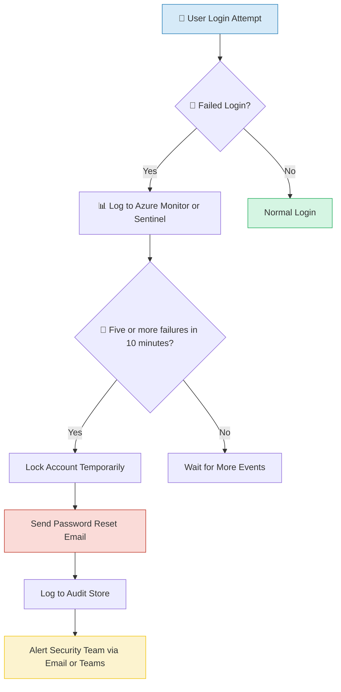

### 🔄 Serverless Architecture for Algonquin Pet Store

Here is both a **diagram** and a **description** of a **typical security automation workflow** for the *Algonquin Pet Store (On Steroids)* — specifically, a **"User Activity Triggers Password Reset Workflow"**.

---

## 🔁 **Use Case: Suspicious Activity Triggers Password Reset**

### 🧠 Scenario:

If a user has **5 failed login attempts within 10 minutes**, an automated workflow should:

1. Lock their account temporarily.
2. Send an email asking them to reset their password.
3. Log the event and alert the security team.

---

### ✅ **Diagram – Automation Flow**

A[🔐 User Login Attempt] --> B{🛑 Failed Login?}
  B -- Yes --> C[📊 Log to Azure Monitor / Sentinel]
  C --> D[🧠 Check if 5+ failures in 10 min (KQL/Logic App)]
  D -- Yes --> E[🔒 Lock Account Temporarily (via API)]
  E --> F[📧 Send Password Reset Email]
  F --> G[📥 Log to Audit Store]
  G --> H[📣 Alert Security Team (Email/MS Teams)]
  D -- No --> Z[🔁 Wait for more events]
  B -- No --> Y[✅ Normal Login]

### ✅ **Step-by-Step Explanation**

| Step | Action                       | Tool                                    | Purpose                      |
| ---- | ---------------------------- | --------------------------------------- | ---------------------------- |
| 1️⃣  | User attempts to log in      | App + Azure AD B2C / Auth0              | Entry point                  |
| 2️⃣  | Failed login logged          | Azure Monitor / Sentinel                | Log events centrally         |
| 3️⃣  | Analyze logs for patterns    | KQL or Azure Logic App                  | Detect brute force attempts  |
| 4️⃣  | Lock the account temporarily | API call or AD B2C rule                 | Block unauthorized access    |
| 5️⃣  | Send reset link to email     | Azure Communication Services / SendGrid | Allow secure recovery        |
| 6️⃣  | Log everything               | Azure Log Analytics / Audit Log         | For compliance and forensics |
| 7️⃣  | Notify team                  | Logic App → MS Teams / Email            | Escalate the incident        |

---

### ✅ **Security Benefits**

* Prevents brute-force account takeovers.
* Automates password recovery securely.
* Ensures all actions are auditable.
* Informs security admins in real-time.

---

Would you like me to generate a PNG version of this diagram for your PowerPoint slide?
